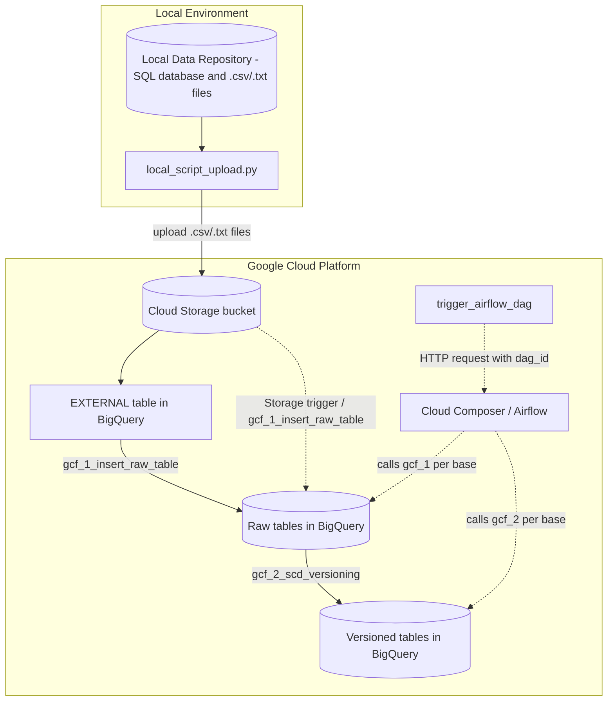

# ETL to GCP

Generic **ETL** process for **integration of data from multiple sources**, capable of loading multiple databases into **BigQuery** using the same set of code, dynamically generating the SQL for each load based on per-base mappings.

Other GCP services also mentioned here: **Cloud Storage**, **Cloud Functions**, **Cloud Build** and **Cloud Composer**.

## 1. Introduction

**The goal of this project is to integrate a data repository in a local environment with a cloud environment on GCP**, making the data available in BigQuery. Consider a scenario where we have a local environment (outside the cloud) holding data files coming from several sources. These sources can be automations that extract data from other systems, or users who generate this data manually. Some of this data may even live in a SQL database, fed by some transactional system (running in that local environment).

Let's also assume that all these bases share one characteristic: they have files associated with each data "load". This data may have been made available by an automation as structured data files, or it may come from a transactional application that generates files at regular intervals (every hour or once a day), but at some point files with this data will be generated.

The goal of this project is to integrate a data repository in a local environment with a cloud environment (let's consider GCP).

The integration process starts with a Python script run locally that uploads the available files to buckets in Google Cloud Storage. Besides the upload, this script is also able to map the bases being loaded and create the corresponding tables in BigQuery. From there on, all the remaining processing (insertion and versioning of the data) happens entirely on the cloud side.

The initial script has no responsibility whatsoever over how or by which system the file was generated/made available. This reinforces that the process works as a layer of **integration of data coming from multiple sources**.

## 2. Project structure

```text
local_script_upload.py              # script that runs in the local environment; uploads files and creates/maps new bases
local_files_to_upload/              # sample files that would be sent to Cloud Storage
google_cloud_functions/
  gcf_1_insert_raw_table/           # cloud function that inserts the data from the external table into the RAW table (accepts HTTP and Storage trigger)
  gcf_2_scd_versioning/             # cloud function that applies versioning (SCD) from the RAW table
  trigger_airflow_dag/              # cloud function that triggers an Airflow DAG via HTTP request
airflow/                            # DAGs and plugins used to orchestrate the loads (Cloud Composer)
```

The `local_files_to_upload/` folder brings a sample file for each base manually mapped in `gcf_1_insert_raw_table/table_definitions_manual.py`, already in the folder/name structure expected by each mapping's `file_pattern` (including the `_dd_mm_yyyy` date suffix).

More details about each component can be found in the respective `readme.md` files inside each folder.

## 3. Flow overview



1. The Python script `local_script_upload.py` runs in the local environment and uploads files from the `local_files_to_upload/` folder to buckets in Cloud Storage. The destination bucket is chosen according to the base's update frequency (daily, hourly or instant), but it could also be defined by other criteria.
2. If the base doesn't exist in BigQuery yet, but has a corresponding table in the local SQL database, the script itself is able to map that base into the process:
  2.1. First, triggering the automatic creation of the respective tables in BigQuery:
   - **External table**: allows querying the content of files stored in the bucket as if they were a regular BigQuery table.
   - **RAW table**: keeps the history of every load already performed for that base, with no deduplication.
   - **Versioned table**: keeps the result of the _Slowly Changing Dimension_ (SCD) process, i.e., the "current" state of each record with validity control.
  2.2. And then, automatically generating the mapping definitions used by the cloud functions to insert data into the RAW table and apply versioning, and writing/pushing (_commit_/_push_) those definitions into the cloud functions' own source code repository (details in section 4).
3. From the external table, the `gcf_1_insert_raw_table` cloud function inserts the data into the corresponding RAW table.
4. Once the load into the RAW table is done, the `gcf_2_scd_versioning` cloud function applies versioning (SCD) of that load into the versioned base.
5. The orchestration of when and which datasets are processed is done via Airflow (Cloud Composer on GCP), with DAGs organized by update frequency (instant, 60 min and 1440 min). DAG execution can be initiated via a schedule or triggered by a Cloud Function named `trigger_airflow_dag`. The `gcf_1_insert_raw_table` function itself could also be triggered directly by a Storage upload event, without relying on Airflow.

### 3.1 External table in BigQuery

An external table is a BigQuery metadata object that describes a _schema_ and points to data that lives outside BigQuery's managed storage (in this case, structured text files in a Cloud Storage bucket), without any physical copy or ingestion of the data into the service. In practice:

- BigQuery only stores the table definition (columns, types, file format, delimiter, URI of the files in the bucket, etc.), defined in the project via `CREATE EXTERNAL TABLE ... OPTIONS (format = 'CSV', uris = [...])`.
- On every query, BigQuery reads and parses the files directly from Cloud Storage at execution time (_schema-on-read_), instead of querying data already loaded into an internal columnar storage (_schema-on-write_), as happens with native tables (RAW and versioned).
- This allows querying the file content with standard SQL syntax, but with some limitations compared to a native table: no optimized clustering/partitioning, no table statistics for the query optimizer, and generally less predictable performance/cost per query, since the read cost depends on the volume of source files read on every execution.
- In this project, every column of the external table is mapped as `STRING`, leaving the _casting_ to the final types to the insertion SQL into the RAW tables. This choice avoids load failures due to type inconsistencies in the source file, handling validation/conversion explicitly and in a controlled way (`SAFE_CAST`) already in the next stage of the pipeline.

### 3.2 SCD (_Slowly Changing Dimension_)

SCD is a dimensional modeling technique used to handle how an entity (a dimension) changes value over time, preserving (or not) the history of those changes. The process implemented here corresponds to a variation of **SCD Type 2** with control by _timestamp_ and _fingerprint_, and works as follows:

- Every run of the versioning cloud function compares the most recent records in the RAW table against the currently valid state in the versioned table, using as comparison key the fields defined in `fields_to_match` (generally, the entity's business primary key).
- To identify whether a record changed, an `im_fingerprint` is computed (a _hash_/signature of the record's relevant fields). If the fingerprint of the record in RAW differs from the fingerprint currently valid in the versioned table, it's understood that the value changed.
- The result is applied via `MERGE` (upsert), preserving history through three control fields:
  - `ts_dt_update`: instant at which that version of the record became valid.
  - `ts_dt_update_previous`: instant at which the previous version of that record stopped being valid (closes the previous version's validity interval).
  - `im_fingerprint`: signature used to detect changes without having to compare field by field on every execution.
- Records that are no longer found in the most recent RAW load can be treated as removed (via `fields_to_delete`/`specific_clause_del`), closing their validity without physically deleting the history already versioned.

Unlike an SCD Type 1 (which overwrites the old value without keeping history) or a "classic" SCD Type 2 (which usually uses a boolean `is_current` _flag_ and a `valid_from`/`valid_to` date pair), here the "current" validity of a record is obtained by querying the version with the highest `ts_dt_update` for each business key, and the equality comparison between loads is done via _fingerprint_ instead of field-by-field comparison.

## 4. Base mappings

Neither of the two processing **cloud functions** (`gcf_1_insert_raw_table` and `gcf_2_scd_versioning`) has any "hardcoded" knowledge about the bases they process: all the executed SQL is dynamically built from a mapping dictionary per base/table. These mappings can exist in two forms:

- **Manual**: defined directly in each function's `table_definitions_manual.py` file, used when the base doesn't meet the criteria required for automatic mapping (for example, tables without a PK in the SQL database, or even without a corresponding table).
- **Automatic**: generated by the Python script itself during the first upload of a base that doesn't yet exist in BigQuery. In this process, the script queries the source table's schema, generates the DDL for the tables (external, RAW and versioned), writes the mapping into the `table_definitions_auto.py` file of each function and performs the _commit_/_push_ of these changes into the Cloud Functions' Git repository.

The _push_ is made directly into the Cloud Functions' source code repository because each of the cloud functions has a `cloudbuild.yaml` file tied to a Cloud Build _trigger_, so that every _push_ to the main branch automatically triggers a new function deploy, publishing a new revision of the function already with the mapping that was just added in `table_definitions_auto.py`.

In both cloud functions, the final dictionary used is the merge (`table_definitions.py`) of the manual and automatic mappings, allowing the same function code to serve any registered base.

More details about each cloud function and the mappings can be found in the respective `readme.md` files inside the `google_cloud_functions/` folder.

## 5. Orchestration with Airflow

The `airflow/` folder contains the DAGs (Cloud Composer) that decide when and for which bases the two cloud functions should be called. No DAG has a fixed list of bases: each one queries a control table (`control_etl_process.tb_ref_tables`) filtering by `update_frequency_min` (`1440`, `60` or `0`) and dynamically builds the same task chain per returned base: `gcf_1_insert_raw_table` → `data_quality` → `gcf_2_scd_versioning` (the latter only when the base is marked as `versioned`).

The `data_quality` task, between the insert into RAW and the versioning, is the point in the pipeline where a data quality check would fit, before releasing the load to SCD; in this project it exists only as a placeholder (the corresponding cloud function was not implemented).

There are three DAGs, one for each update frequency: the `1440` and `60` minute ones run on fixed schedules, while the `0` (instant) frequency one has no schedule of its own and only runs when triggered on demand by the `trigger_airflow_dag` cloud function. More details on each DAG are in the `airflow/readme.md` file.
