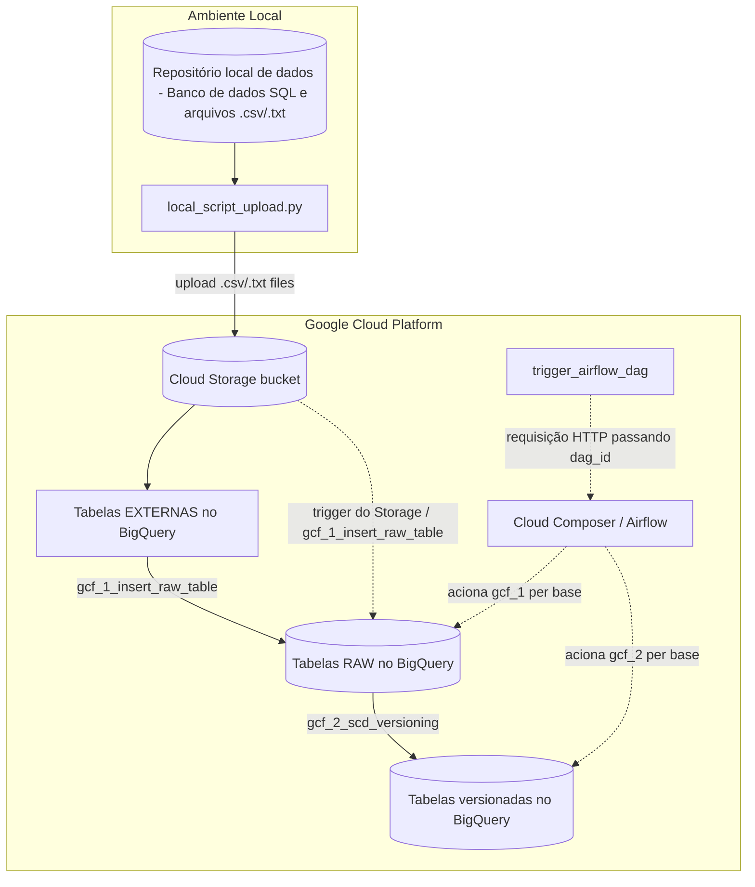

# ETL de bases para GCP

Processo de **ETL** genérico para **integração de dados de diversas fontes**, capaz de carregar múltiplas bases de dados para o **BigQuery** usando o mesmo conjunto de códigos, gerando o SQL de cada carga de forma dinâmica a partir de mapeamentos por base.

Outros serviços do GCP que também são mencionados: **Cloud Storage**, **Cloud Functions**, **Cloud Build** e **Cloud Composer**.

## 1. Introdução

**O objetivo desse projeto é integrar um repositório de dados em ambiente local a um ambiente cloud GCP**, disponibilizando os dados no BigQuery. Vamos considerar o cenário em que temos um ambiente local (fora da cloud) que possui arquivos dados oriundos de diversas fontes. Essas fontes podem automações que realizam extrações de outros sistemas ou de usuários que geram esses dados de forma manual. Alguns desses dados podem até mesmo estar em um banco de dados SQL, que é alimentado por algum sistema transacional (rodando nesse ambiente local).

Vamos supor também que todas essas bases de dados tem uma característica em comum: elas possuem arquivos associados a cada "carga" de dados. Esses dados podem ter sido disponibilizados por uma automação como arquivos de dados estruturados, ou podem vir de uma aplicação transacional que gera arquivos a cada intervalo de tempo (a cada hora ou uma vez ao dia), mas em algum momento serão gerados arquivos desses dados.

O objetivo desse projeto é integrar um repositório de dados em ambiente local a um ambiente cloud (vamos considerar o GCP).

O processo de integração inicia por um script Python executado localmente que faz o upload dos arquivos disponíveis para buckets no Google Cloud Storage. Além do upload, esse script também é capaz de mapear as bases que estão sendo carregadas e criar as tabelas correspondentes no BigQuery. A partir daí, todo o restante do processamento (inserção e versionamento dos dados) acontece inteiramente no lado cloud.

O script incial não tem qualquer responsabilidade sobre como ou por qual sistema o arquivo foi gerado/disponibilizado. Reforçando que o processo funciona como uma camada de **integração de dados vindos de múltiplas fontes**.

## 2. Estrutura do projeto

```text
local_script_upload.py              # script que roda no ambiente local; faz upload dos arquivos e cria/mapeia novas bases
local_files_to_upload/              # exemplos dos arquivos que seriam enviados ao Cloud Storage
google_cloud_functions/
  gcf_1_insert_raw_table/           # cloud function que insere os dados da tabela externa na tabela RAW (aceita HTTP e trigger do Storage)
  gcf_2_scd_versioning/             # cloud function que aplica o versionamento (SCD) a partir da tabela RAW
  trigger_airflow_dag/              # cloud function que dispara uma DAG do Airflow via requisição HTTP
airflow/                            # DAGs e plugins usados para orquestrar as cargas (Cloud Composer)
```

A pasta `local_files_to_upload/` traz um arquivo de exemplo para cada base mapeada manualmente em [`gcf_1_insert_raw_table/table_definitions_manual.py`](google_cloud_functions/gcf_1_insert_raw_table/table_definitions_manual.py), já na estrutura de pasta/nome esperada pelo `file_pattern` de cada mapeamento (incluindo o sufixo de data `_dd_mm_aaaa`).

Mais detalhes sobre cada componente podem ser encontrados nos respectivos arquivos `readme.md` dentro de cada pasta.

## 3. Visão geral do fluxo



1. O script Python `local_script_upload.py` roda no ambiente local e faz o upload de arquivos na pasta `local_files_to_upload/` para buckets no Cloud Storage. O bucket de destino é escolhido de acordo com a frequência de atualização da base (diária, horária ou instantânea), mas também poderia ser definido de acordo com outros critérios.
2. Caso a base ainda não exista no BigQuery, mas possua uma tabela correspondente no banco SQL local, o próprio script é capaz de mapear essa base no processo:
  2.1. Primeiro, isparando a criação automática das respectivas tabelas no BigQuery:
   - **Tabela externa**: permite consultar o conteúdo dos arquivos armazenados no bucket como se fossem uma tabela comum do BigQuery.
   - **Tabela RAW**: guarda o histórico de todas as cargas já realizadas para aquela base, sem tratamento de duplicidade.
   - **Tabela versionada**: guarda o resultado do processo de _Slowly Changing Dimension_ (SCD), isto é, o estado "atual" de cada registro com controle de vigência.
  2.2. E depois, gerando automaticamente a definição dos mapeamentos usados pelas cloud functions para inserir os dados na tabela RAW e aplicar o versionamento, e gravando/enviando (_commit_/_push_) essas definições no repositório de código-fonte das próprias cloud functions (detalhes na seção 4).
3. A partir da tabela externa, a cloud function `gcf_1_insert_raw_table` insere os dados na tabela RAW correspondente.
4. Uma vez feita a carga na tabela RAW, a cloud function `gcf_2_scd_versioning` aplica o versionamento (SCD) dessa carga na base versionada.
5. A orquestração de quando/quais bases devem ser processadas é feita via Airflow (no GCP é o serviço Cloud Composer), com DAGs organizadas por frequência de atualização (instantânea, 60 min e 1440 min). A execução das DAGs pode ser iniciada via agendamento ou disparada por uma cloud function chamada `trigger_airflow_dag`. A própria `gcf_1_insert_raw_table` também poderia ser acionada diretamente por um evento de upload no Storage, sem depender do Airflow.

### 3.1 Tabela externa (_external table_) no BigQuery

Uma tabela externa é um objeto de metadados do BigQuery que descreve um _schema_ e aponta para dados que residem fora do armazenamento gerenciado do BigQuery (nesse caso, arquivos de texto estruturados em um bucket do Cloud Storage), sem que haja cópia ou ingestão física dos dados para dentro do serviço. Na prática:

- O BigQuery armazena apenas a definição da tabela (colunas, tipos, formato do arquivo, delimitador, URI dos arquivos no bucket etc), definida no projeto via `CREATE EXTERNAL TABLE ... OPTIONS (format = 'CSV', uris = [...])`.
- A cada consulta, o BigQuery lê e faz o _parsing_ dos arquivos diretamente no Cloud Storage no momento da execução (_schema-on-read_), em vez de consultar dados já carregados em um armazenamento colunar interno (_schema-on-write_), como ocorre nas tabelas nativas (RAW e versionada).
- Isso permite consultar o conteúdo dos arquivos com sintaxe SQL padrão, mas com algumas limitações em relação a uma tabela nativa: sem clusterização/particionamento otimizado, sem estatísticas de tabela para o otimizador de consultas e, em geral, com desempenho e custo por consulta menos previsíveis, já que o custo de leitura depende do volume dos arquivos-fonte lidos a cada execução.
- Nesse projeto, todas as colunas da tabela externa são mapeadas como `STRING`, deixando o _casting_ para os tipos definitivos a cargo do SQL de inserção nas tabelas RAW. Essa escolha evita falhas de carga por inconsistência de tipo no arquivo de origem, tratando a validação/conversão de forma explícita e controlada (`SAFE_CAST`) já na etapa seguinte do pipeline.

### 3.2 SCD (_Slowly Changing Dimension_)

SCD é uma técnica de modelagem dimensional usada para tratar como uma entidade (uma dimensão) muda de valor ao longo do tempo, preservando (ou não) o histórico dessas mudanças. O processo implementado aqui corresponde a uma variação do **SCD Tipo 2** com controle por _timestamp_ e _fingerprint_, e funciona da seguinte forma:

- Cada execução da cloud function de versionamento compara os registros mais recentes da tabela RAW com o estado atualmente vigente na tabela versionada, usando como chave de comparação os campos definidos em `fields_to_match` (em geral, a chave primária de negócio da entidade).
- Para identificar se um registro mudou, é calculado um `im_fingerprint` (um _hash_/assinatura dos campos relevantes do registro). Se o fingerprint do registro na RAW for diferente do fingerprint vigente na tabela versionada, entende-se que houve uma alteração de valor.
- O resultado é aplicado via `MERGE` (upsert), preservando o histórico através de três campos de controle:
  - `ts_dt_update`: instante em que aquela versão do registro passou a ser vigente.
  - `ts_dt_update_previous`: instante em que a versão anterior daquele registro deixou de ser vigente (fecha o intervalo de validade da versão anterior).
  - `im_fingerprint`: assinatura usada para detectar mudanças sem precisar comparar campo a campo a cada execução.
- Registros que não são mais encontrados na carga mais recente da RAW podem ser tratados como removidos (via `fields_to_delete`/`specific_clause_del`), fechando sua vigência sem apagar fisicamente o histórico já versionado.

Diferente de um SCD Tipo 1 (que sobrescreve o valor antigo sem manter histórico) ou de um SCD Tipo 2 "clássico" (que costuma usar uma _flag_ booleana `is_current` e um par de datas `valid_from`/`valid_to`), aqui a vigência "atual" de um registro é obtida consultando a versão com o maior `ts_dt_update` para cada chave de negócio, e a comparação de igualdade entre cargas é feita via _fingerprint_ em vez de comparação campo a campo.

## 4. Mapeamentos das bases

As duas **cloud functions** de processamento (`gcf_1_insert_raw_table` e `gcf_2_scd_versioning`) não têm nenhum conhecimento "hardcoded" sobre as bases que processam: todo o SQL executado é montado dinamicamente a partir de um dicionário de mapeamento por base/tabela. Esses mapeamentos podem existir de duas formas:

- **Manual**: definido diretamente nos arquivos `table_definitions_manual.py` de cada função, usado quando a base não segue os critérios necessários para o mapeamento automático (por exemplo, tabelas sem PK no banco SQL ou mesmo sem uma tabela correspondente).
- **Automático**: gerado pelo próprio script Python durante o primeiro upload de uma base que ainda não existe no BigQuery. Nesse processo, o script consulta o schema da tabela de origem, gera o DDL das tabelas (externa, RAW e versionada), grava o mapeamento no arquivo `table_definitions_auto.py` de cada função e efetua o _commit_/_push_ dessas alterações no repositório Git das Cloud Functions.

O _push_ é feito diretamente no repositório de código-fonte das Cloud Functions pois cada uma das cloud functions possui um arquivo `cloudbuild.yaml` associado a um _trigger_ do Cloud Build, de forma que todo _push_ na branch principal dispara automaticamente um novo deploy da function, publicando uma nova revisão da função já com o mapeamento recém-adicionado em `table_definitions_auto.py`.

Em ambas cloud functions, o dicionário final usado é a junção (`table_definitions.py`) dos mapeamentos manuais e automáticos, permitindo que o mesmo código das funções sirva para qualquer base cadastrada.

Mais detalhes sobre cada uma das cloud functions e dos mapeamentos podem ser encontrados nos respectivos arquivos `readme.md` dentro da pasta `google_cloud_functions/`.

## 5. Orquestração com Airflow

A pasta `airflow/` contém as DAGs (Cloud Composer) que decidem quando e para quais bases as duas cloud functions devem ser chamadas. Nenhuma DAG tem uma lista fixa de bases: cada uma consulta uma tabela de controle (`control_etl_process.tb_ref_tables`) filtrando por `update_frequency_min` (`1440`, `60` ou `0`) e monta, dinamicamente, a mesma cadeia de tasks por base retornada: `gcf_1_insert_raw_table` → `data_quality` → `gcf_2_scd_versioning` (esta última só quando a base estiver marcada como `versioned`).

A task de `data_quality`, entre o insert na RAW e o versionamento, é o ponto do pipeline onde caberia uma checagem de qualidade da carga antes de liberá-la para o SCD; neste projeto ela existe apenas como um espaço reservado (a cloud function correspondente não foi implementada).

Existem três DAGs, uma para cada frequência de atualização: as de `1440` e `60` minutos rodam em agendamentos fixos, enquanto a de frequência `0` (instantânea) não possui agendamento próprio e só roda quando é disparada sob demanda pela cloud function `trigger_airflow_dag`. Mais detalhes de cada DAG estão no arquivo `airflow/readme.md`.
